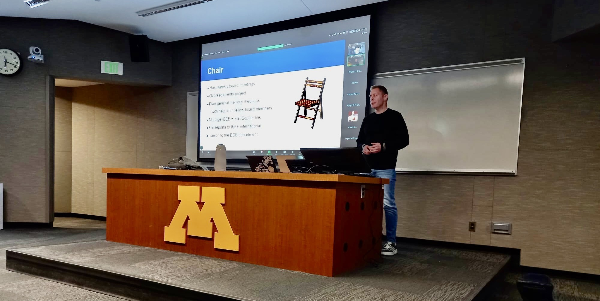

  

- 👋🏼 Hi! I'm Soren, a Wisconsin native doing research in computational archival science (CAD) using Extended Reality (XR), Artificial Intelligence (AI), and hardware engineering to develop immersive tools for interacting with archival documents and artifacts. My work is interdisciplinary and is at the intersection of historiography, classical archival management, and computer science & engineering. It contains elements of CSE + Humanities. 
- 🌱 I am currently building a multidisciplinary team of undergraduate and graduate student researchers for the duration of my program at UWM under the supervision of my faculty advisor. 
- 👀 My interest is in sustainable hardware engineering, hardware & software integration, 3D modeling of historical documents and artifacts, promoting historical pedagogy.
- 🧑🏼‍🏫 My areas of expertise include historical writing and research, computer engineering, process engineering/development, idea generation, implementation, & demonstration, teaching. 
- 🤠 My core identity remains a historian and classical archivist. I use computation to develop tools to better engage with historical data and primary sources. Take, for example, the Freedom Rides in 1961. A student can read about the riders and their experience on their journey from Washington DC to New Orleans. They can read about the angry mob of local residents who attacked the busses and the riders, setting fires and leaving them injured. With with our immersive tools, students will be able to sit next to a rider and using AI that has been trained with primary source data, the student can interact with the rider and have a conversation with them in real time. This will also be true of institutional archives, and how we will interact with them. For me, this is the future of historical pedagogy and archival management & engagement.  
- 💬 "To sum up computation archival science in ~6 words: information, conversion, efficiency, context, & design." - Soren Steven Miller
- 📫 How to reach me: https://z.umn.edu/SSM-LinkedIn
-->
